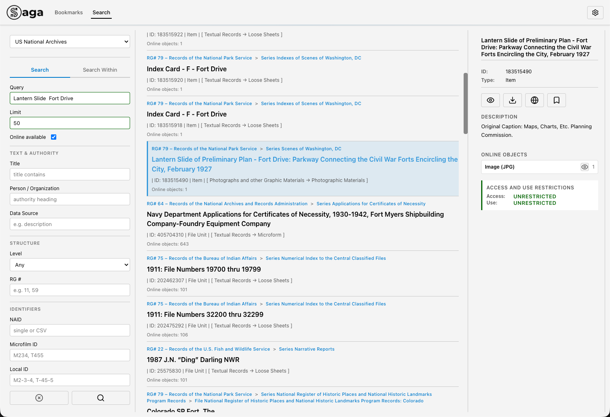
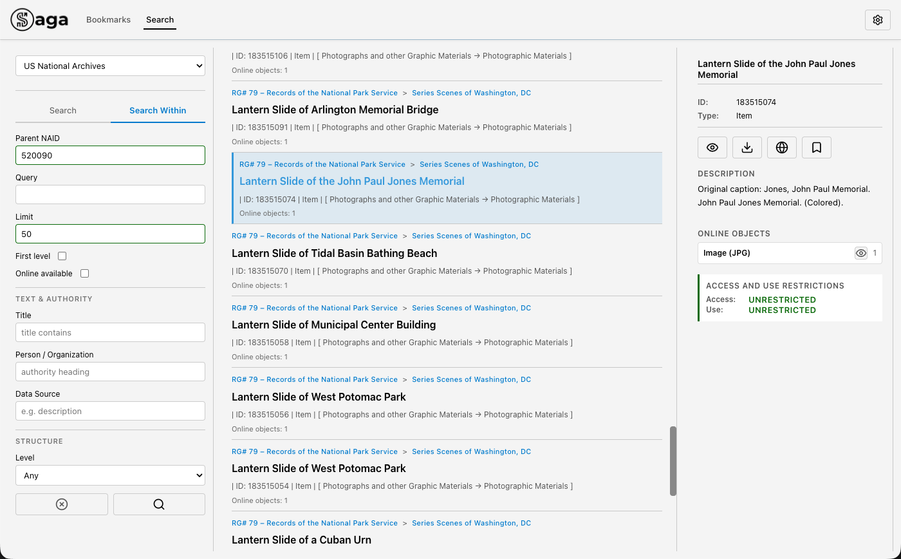
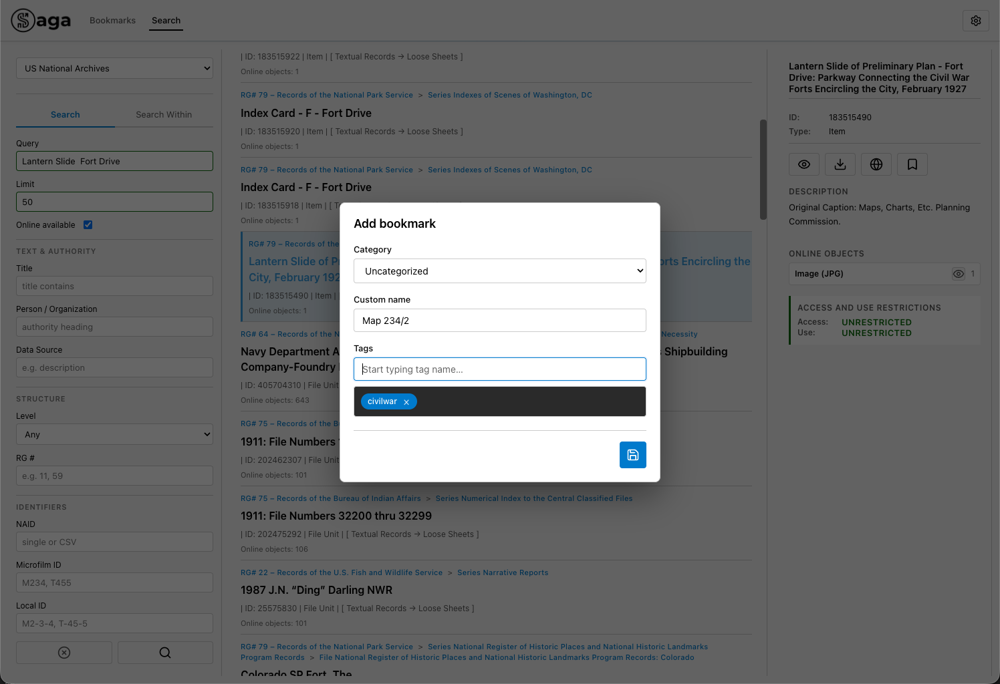
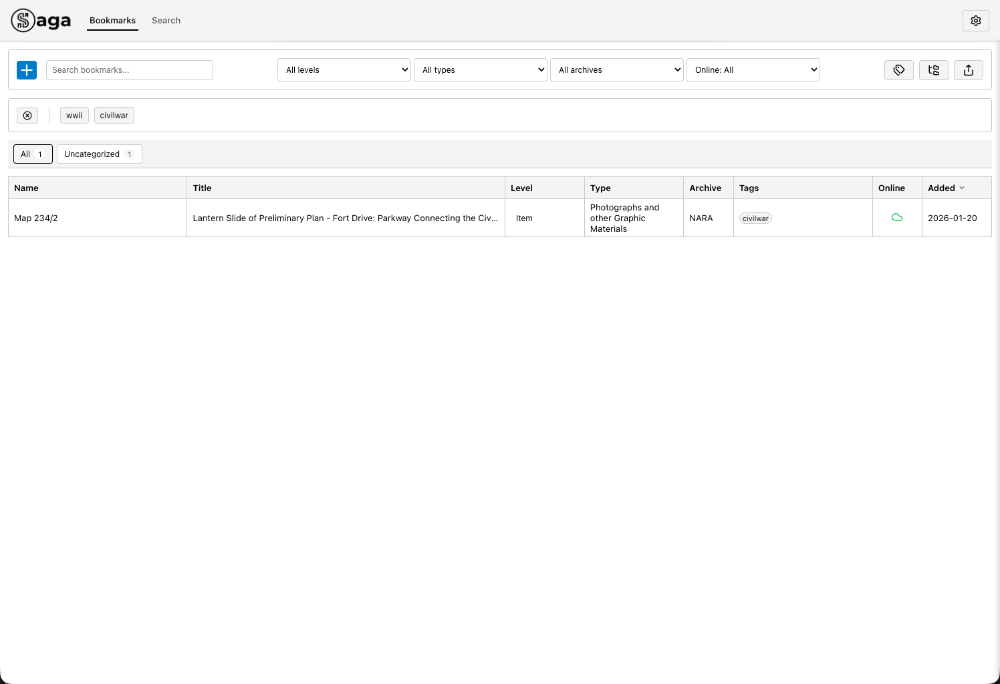
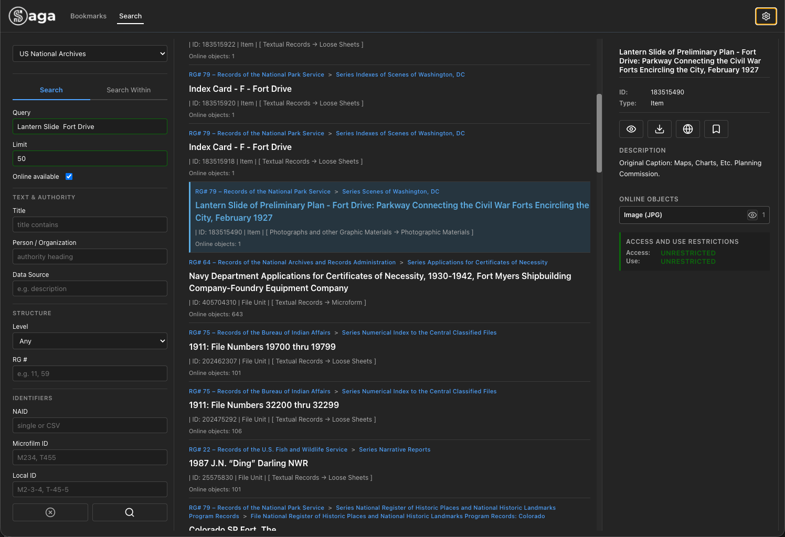
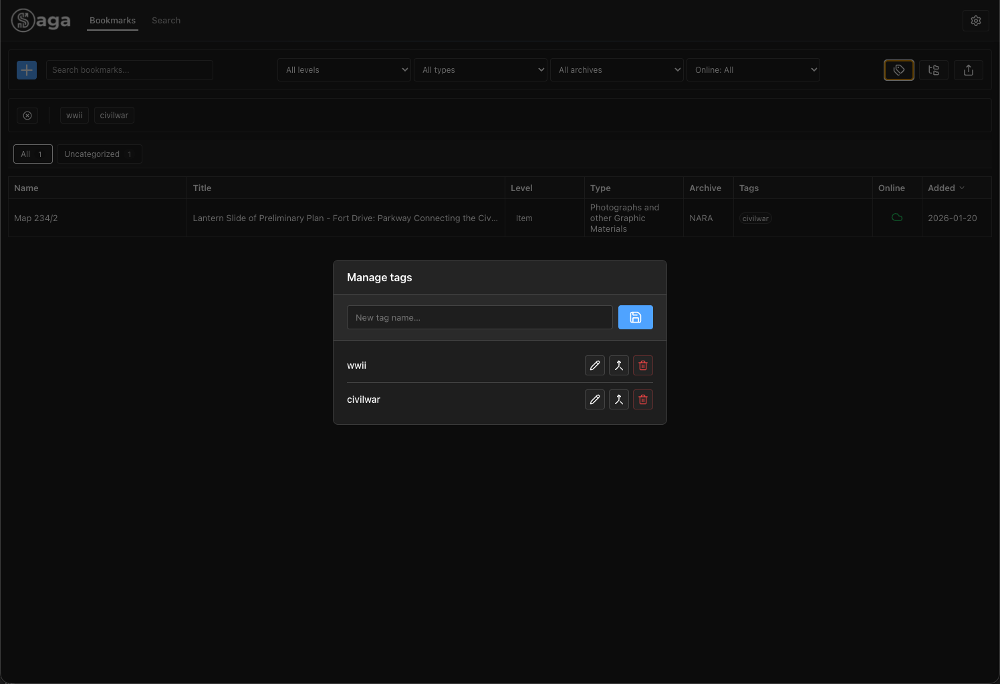

# Saga — Archive Search and Document Workspace v1

## What Saga Is

Saga is a local tool for working with archives and large document collections, built from the perspective of someone who actively works with primary sources (archives, document databases, institutional collections).

The project was created to address recurring problems encountered during:
• searching archival databases,
• downloading large sets of documents,
• working across multiple sources,
• maintaining research context over time.

Saga is infrastructure that supports the search, collection, and organization phase of archival and research work.

⸻

## The Problem Saga Addresses

In practical archival and research work, the same issues repeatedly appear:
• fragmented search interfaces,
• limited batch operations,
• loss of context after downloading files,
• ad-hoc, non-persistent notes and bookmarks,
• lack of local control over collected material,
• difficulty reusing previously found sources.

Saga was built specifically for this gap.

⸻

## What Saga Does

Saga allows users to:
• search archival records from a single workspace,
• quickly download individual documents or entire result sets,
• index downloaded material locally,
• organize and group files,
• bookmark records and documents,
• maintain continuity between research sessions.

⸻

## Intended Users

Saga may be useful for people who:
• work with archival or primary-source material,
• conduct historical, legal, or institutional research,
• manage large document collections,
• need fast, repeatable access to sources.

⸻

## Project Status

Saga is an open-source project.
Functionality is developed in response to real archival and research needs, not as a commercial product.
The project is treated as working infrastructure, not a finished platform.

⸻

## License

Apache License 2.0

⸻

# Tech Stack

• Electron
• Node.js integration
• React
• TypeScript
• Vite
• CSS Modules
• better-sqlite3

⸻

**External Data Models and Sources**
• EAD (Encoded Archival Description)
Used as the internal structural data model.
Preserves archival hierarchy and contextual relationships between records.
Specification: https://www.loc.gov/ead/EAD3taglib/index.html#elem-controlaccess
• NARA API
Used for querying and retrieving archival record metadata and document references.

Saga operates in **read-only** mode with all external archival sources.
No data is modified or written back to source systems.

⸻

# Usage

**Supported Platforms**
• macOS (Apple Silicon / Intel)
• Windows 10+
• Linux (AppImage)

Built and tested on macOS.

**Storage**
• Local SQLite database
• Local user filesystem

**API Key** provided by NARA.

**Prerequisites**

To build and run Saga locally, the following tools are required:

Required
• Node.js (LTS version recommended)
• npm (included with Node.js)

Electron does not need to be installed globally.
It is installed locally as a project dependency during npm install.

To run Saga in development mode:

```bash
npm install
npm run dev
```

To build a production version locally:

```bash
npm run build
npm run build:electron
```

**Notes**
• Saga does not auto-update.
• Each build is fully self-contained.
• User data (database, downloads, settings) is stored outside the application bundle and survives upgrades or rebuilds.

⸻

## First Launch

1. Launch the Saga application.
2. On first start:
   • A local database is created
   • Basic structures are initialized (categories, tags, settings)
   • No data is sent externally
3. Before starting work, configure:
   • Download directory
   • API key for the archival source (if required)
   • Click 'Migrate localStorage to SQLite'
4. Enjoy.

⸻

# Features

## Overview

**Core Capabilities**
• Search external archival databases using API instead of web interface (NARA for now)
• Quick document preview
• Fast download, individually or in bulk
• Save to favorites
• Favorites database, categories, and tagging
• Dark mode

**Typical workflow in Saga:**

1. **Search**
   • Search records in external archive
   • Filter results by available criteria (description level, availability, relationships)

2. **Preview**
   • Preview archival structure
   • Quick preview of available files (if they exist)

3. **Download**
   • Download individual files
   • Download entire document sets
   • Save to specified local directory

4. **Organize**
   • Add records to favorites
   • Assign categories and tags
   • Edit local metadata (without modifying the source)

5. **Continue Work**
   • Return to saved records
   • Continue work in subsequent sessions
   • Maintain full research context

## Detailed Features

**Search**
• Search records (via NARA API)
• Search within record groups and series
• Preview record details
• Search field, results list, and preview on one screen

**Search Modes**

Saga supports two search modes:

_Global Search_
• Search across the entire archive collection
• Entry point for material exploration

_Search Within_
• Search within a specific parent record
• Preserve archival hierarchy context
• Useful when working with large record groups

⸻

**Preview and Navigation**
• Quick document preview within file units
• Quick access to documents associated with a record

⸻

**Download Management**
• Download individual files
• Download document batches
• Configurable save location
• Download progress tracking

⸻

**Local Organization**
• Save bookmarks to local database
• Category system (hierarchical or flat)
• Tag system
• Category manager
• Tag manager
• Export data to JSON

**Bookmarks and Collections**
• Any record or file can be saved locally
• User decides:
• What to save
• How to group it
• What meaning to assign
• Saved data does not affect the archival source

⸻

# Future Development

Planned features include:
• Connection to custom, local archive
• Module for scanning, content analysis, OCR, and generating reports on: keywords, names, dates, locations, etc.
• Connection to other sites like UK National Archive (in tests) or Archives Portal Europe.

---

# Screenshots














